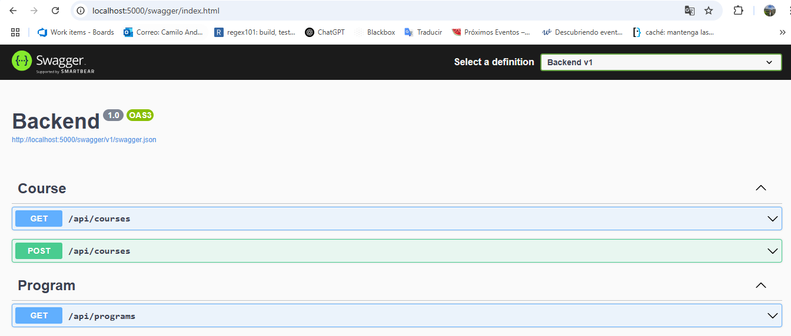
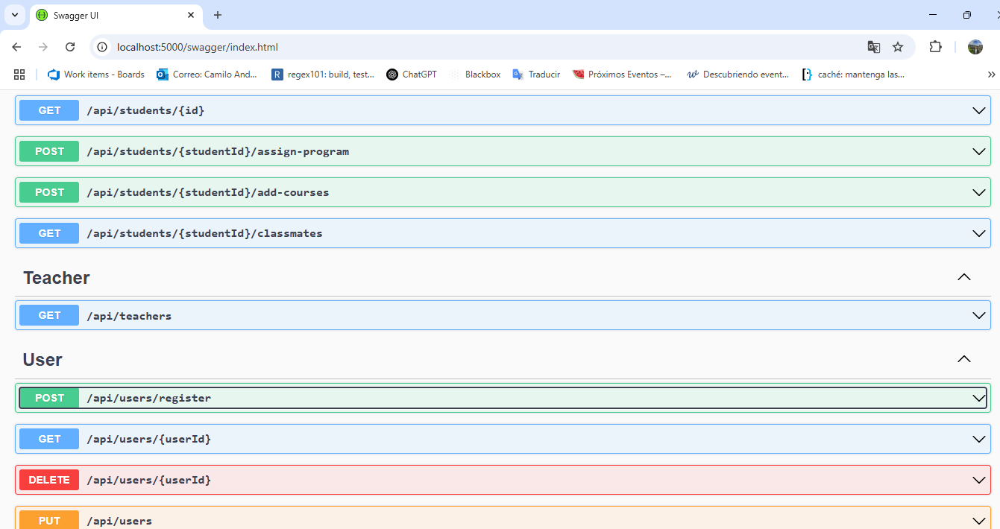

# AcademiaPortal - Backend

## 🚀 Descripción
AcademiaPortal es una API desarrollada en **.NET 8 y SQL Server** que permite gestionar estudiantes, profesores y materias en un sistema académico. 
Los estudiantes pueden inscribirse en programas de estudio, seleccionar materias y visualizar a sus compañeros de clase. 

Este proyecto está diseñado con una **arquitectura en capas** y se ejecuta en **contenedores Docker** o de forma local.

Camilo Chaparro - Desarrollador de Software

---

## 🛠️ Tecnologías Utilizadas
- **.NET 8** (ASP.NET Core Web API)
- **Entity Framework Core** (Manejo de base de datos)
- **SQL Server** (Base de datos relacional)
- **Docker** (Contenedores para la API y la base de datos)
- **Swagger** (Documentación de API)
- **Linq y EF Migrations** (Consultas y migraciones de base de datos)

---

## ⚙️ Prerrequisitos
Antes de ejecutar el proyecto, asegúrate de tener instalados:
- [Docker](https://www.docker.com/get-started)
- [.NET SDK 8](https://dotnet.microsoft.com/en-us/download)
- [Git](https://git-scm.com/downloads)
- [SQL Server](https://www.microsoft.com/en-us/sql-server/sql-server-downloads) (Si ejecutas sin Docker)

---

## Paso a Paso para Ejecutar el Proyecto

### **1️⃣ Clonar el Repositorio**
```bash
git clone https://github.com/tu-usuario/AcademiaPortal.git
cd AcademiaPortal
```

## Con Docker

### **2️⃣ Configurar la Base de Datos en Contenedor**
El proyecto usa **SQL Server en Docker**. Para iniciarlo, ejecuta:
```bash
docker-compose up -d
```
Esto levantará:
- Un contenedor de **SQL Server** en el puerto `1433`
- Un contenedor con la **API** en el puerto `5000`

### **3️⃣ Aplicar Migraciones de la Base de Datos**
Ejecuta los siguientes comandos para asegurarte de que las migraciones se ejecuten correctamente dentro del contenedor `migrations`:
```bash
docker exec -it migrations bash
```
Dentro del contenedor, ejecuta:

Instala Entity Framework CLI
```bash
dotnet tool install --global dotnet-ef --version 8.0.0

export PATH="$PATH:/root/.dotnet/tools"  
```

Restaura herramientas necesarias
```bash
dotnet tool restore

```
Aplica migraciones en la base de datos
```bash
dotnet ef database update --project Infrastructure --startup-project Backend --msbuildprojectextensionspath ../Infrastructure/obj  
```
Esto aplicará las migraciones correctamente.

---

## Sin Docker

### **2️⃣ Configurar la Base de Datos Localmente**
Si no usas Docker, asegúrate de tener instalado **SQL Server** y crea manualmente la base de datos:
1. Abre **SQL Server Management Studio (SSMS)** o usa `sqlcmd`.
2. Ejecuta el siguiente comando para crear la base de datos:
```sql
CREATE DATABASE AcademiaPortalDB;
```
3. Asegúrate de que la conexión en `Backend/appsettings.json` sea correcta:
```json
{
  "ConnectionStrings": {
    "DefaultConnection": "Server=localhost;Database=AcademiaPortalDB;User Id=sa;Password=Test1234;Encrypt=false;TrustServerCertificate=true;"
  }
}
```

### **3️⃣ Aplicar Migraciones**
Si corres el proyecto localmente, aplica las migraciones con:
```bash
dotnet tool install --global dotnet-ef --version 8.0.0  # Instala EF CLI (si no está instalado)
dotnet ef database update --project Infrastructure --startup-project Backend  # Aplica migraciones
```

### **4️⃣ Ejecutar la API**
```bash
dotnet run --project Backend
```
La API estará disponible en: **http://localhost:5000/swagger**

### **5️⃣ Probar la API con Swagger**
Abre en tu navegador:
```
http://localhost:5000/swagger
```
Aquí puedes probar todos los endpoints disponibles.

---

## 📌 Notas Adicionales
- La conexión a la base de datos está definida en `Backend/appsettings.json`.
- Para detener los contenedores, usa:
```bash
docker-compose down
```
- Si necesitas regenerar la base de datos, elimina el volumen con:
```bash
docker volume rm academiaportal_sqlserver_data
```

## 🔍 Previsualización



<br>




